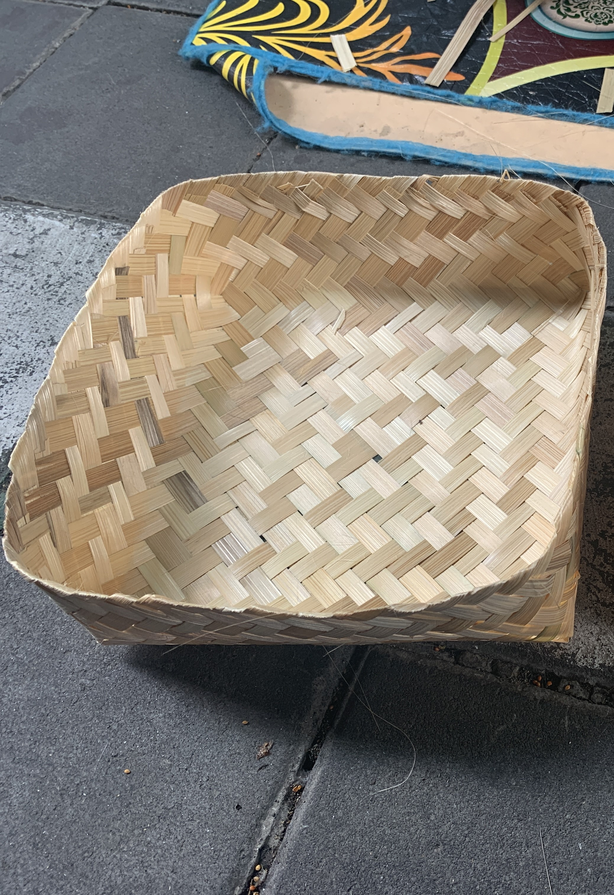
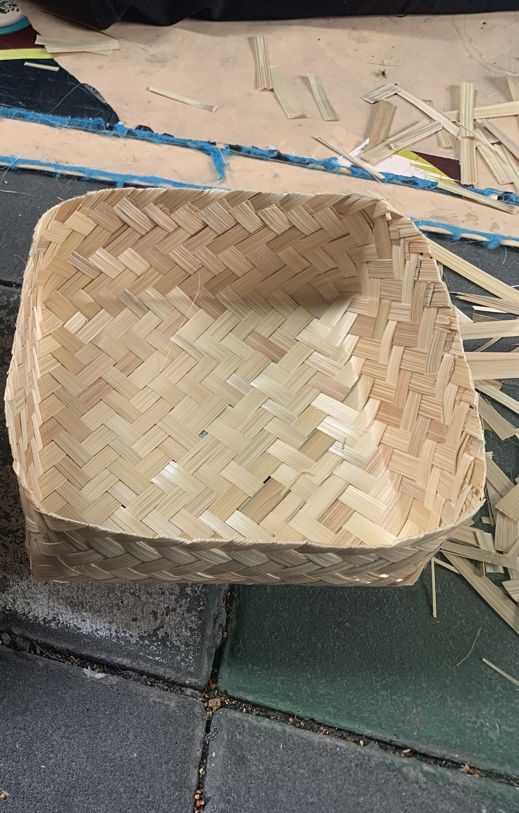

<!DOCTYPE html>
<html lang="en">
<head>
    <meta charset="UTF-8">
    <meta name="viewport" content="width=device-width, initial-scale=1.0">
    <title>Estimasi Produksi</title>
    
</head>
<body>
    <h2>Estimasi Produksi Besek</h2>
    <button onclick="estimasiProduksi()">Hitung Estimasi</button>
    

</section>

<button onclick="goBack()">Kembali</button>

</body>
</html>
